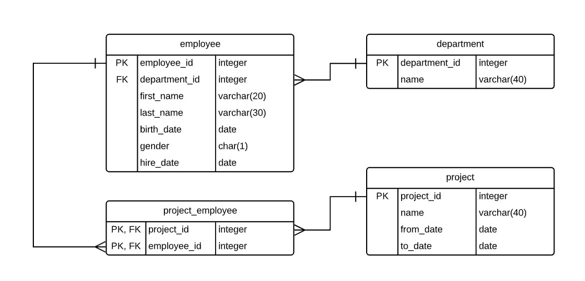
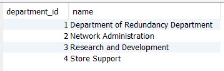
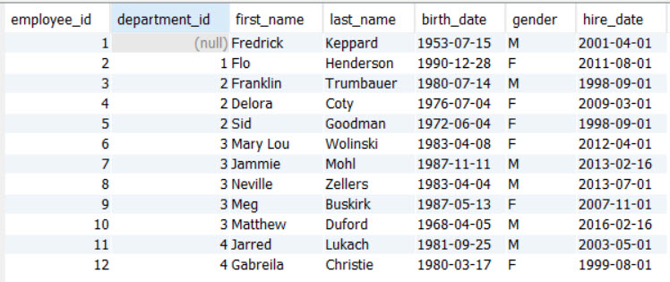
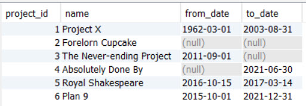
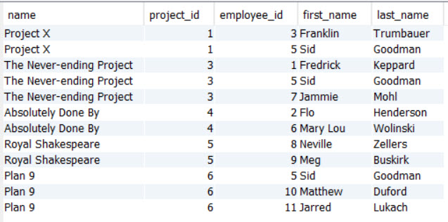

# Project Organizer Database Access

## Part 1 - Setting up your database

This assignment continues to work with a database that is similar to the design that you came up with. It managas departments, employees and projects

The assignment, however, requires that you use a very specific table structure (schema) for the **projects** database. The scripts to create this schema are included in this folder.

These scripts will drop and re-create the database for you. The scripts WILL NOT add any data to your database. You will use this Java application to INSERT, UPDATE and DELETE all records.

    In this database we will NOT be using any auto number fields, so your scripts must add include  hardcoded values for all primary keys (department_id, employee_id, project_id).

To run the script, open a git bash terminal window to the **_database_** folder and execute the **create_db.sh** script.

```
sh create_db.sh
```

### The **projects** database schema

You should familiariaze yourself with the structure of the database as you work on this assignment.



### **NOTE:**

As you work through the exercise, you will be adding and changing data. This could lead to inconsistent data in the database. You can reset the database at any time by re-running the script above.

```
sh create_db.sh
```

## Part 2 - Working with departments

Open the `Part2Departments.java` file and complete the functions to add, update and delete all departments. Complete the functions to select departments from the database (to verify that the insert/update/delete functions worked);

You will add the following departments to the database:



## Part 3 - Working with employees

Open the `Part3Employees.java` file and complete the functions to add, update and delete all employees. Complete the functions to select employees from the database (to verify that the insert/update/delete functions worked);

You will add the following employees to the database:



## Part 4 - Working with projects

Open the `Part4Projects.java` file and complete the functions to add, update and delete all projects. Complete the functions to select projects from the database (to verify that the insert/update/delete functions worked);

You will add the following projects to the database:



## Part 5 - Assigning Employees to Projects

Open the `Part5ProjectEmployees.java` file and complete the functions to add and remove employees to/from projects. Complete the functions to select projects and their assigned employees;

You will add the following employees to projects:


