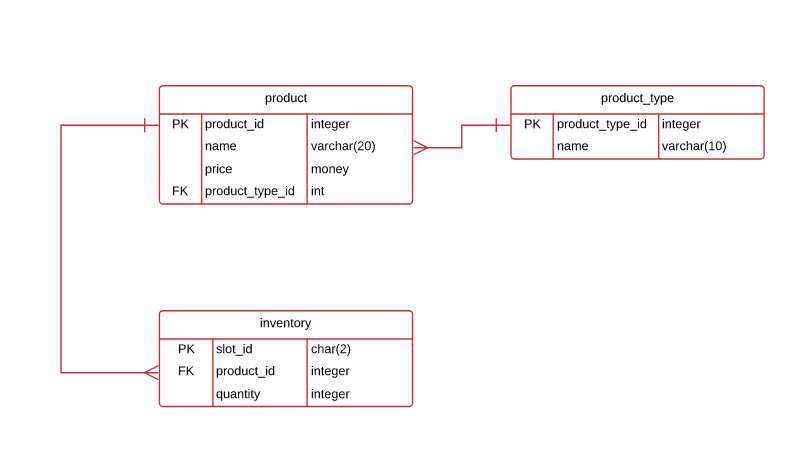
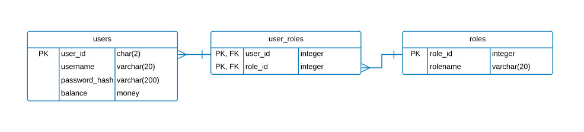

# Vending Machine
This is a distributed version of the Vending Machine application. 

## Client
This is the UI/UX portion of the application. No business logic lives in this application. All logic is related to the user interface. The business decisions that need to be made should be delegated to the API.

## Server
This is the API version of the application. All Vending Machine business logic lives in the API.

The server is made up of the following endpoints.

```
BASE_URL
http://localhost:8080

AUTHENTICATION
/register - POST -> BODY RegisterDTO
/login - POST -> BODY LoginDTO

USER
/users/deposit/{id} - POST -> BODY Deposit

PRODUCTS
/products - GET -> Product[]
/products/{id} - GET -> Product
/products/slot/{id} - GET -> Product -> find by slot id
/products/purchase/{id} - PUT -> Auth -> BODY product -> purchases for logged in user
/products/restock/{id} - PUT -> Auth (ADMIN) -> BODY product -> updates stock of specified product

```

## Database

There are 3 tables related to products


There are 3 tables related to users and roles
